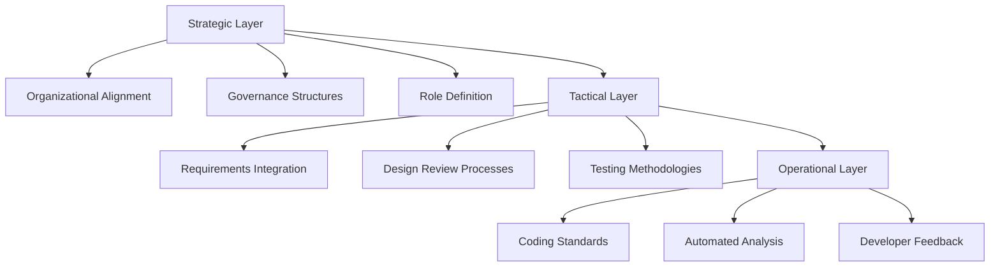
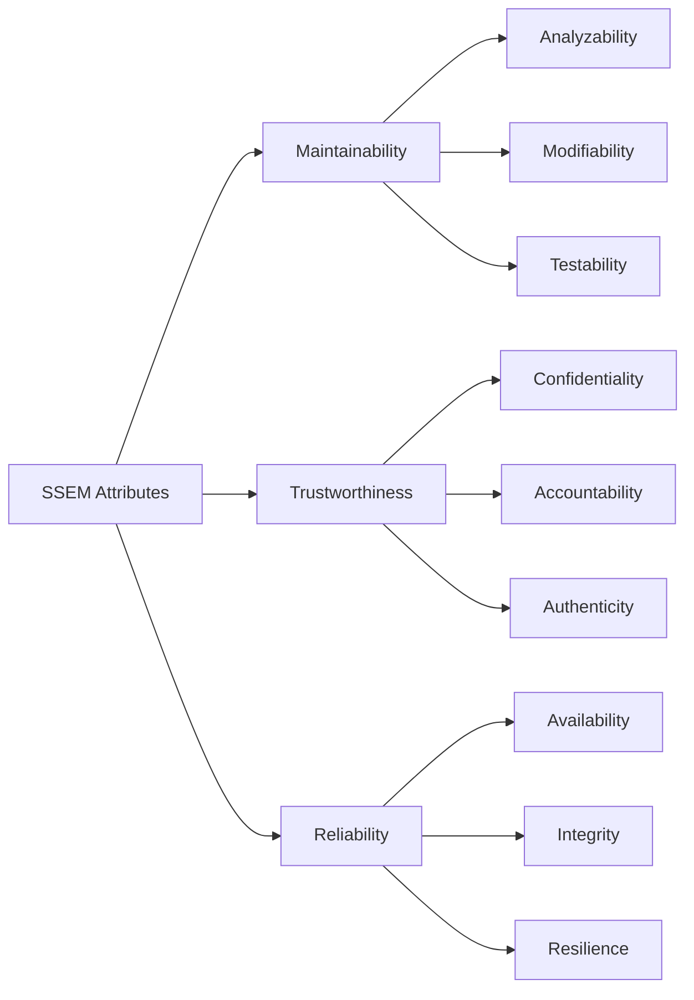
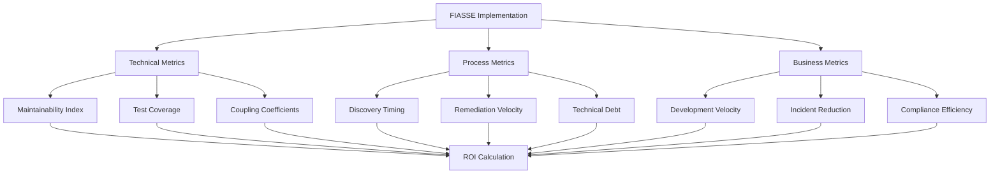

# Understanding and Implementing FIASSE with SSEM: A Modern Approach to Application Security

## Abstract

This chapter presents the Framework for Integrating Application Security into Software Engineering (FIASSE) and the Securable Software Engineering Model (SSEM) as transformative approaches to application security. Through evidence-based analysis and practical implementation guidance, we demonstrate how these frameworks address persistent challenges in application security while delivering measurable business value. The chapter provides advanced practitioners with actionable strategies for integrating FIASSE principles into existing security programs, establishing metrics for success, and overcoming organizational resistance to change.

---

## 1. The Business Case for FIASSE: Data-Driven Security Transformation

### Economic Impact and Risk Reduction

The traditional application security model faces a critical efficiency crisis. According to the 2024 State of Software Security report by Veracode, organizations spend an average of $4.88 million annually on application security initiatives, yet 76% of applications still contain at least one security flaw upon initial scanning (Veracode, 2024). More concerning, the average time to remediate critical vulnerabilities remains at 198 days, creating extended exposure windows that compound business risk.

FIASSE adoption demonstrates significant economic advantages through three primary mechanisms: reduced remediation costs, accelerated time-to-market, and decreased security debt accumulation. Organizations implementing FIASSE principles report a 45% reduction in vulnerability remediation time and a 60% decrease in critical security findings during late-stage testing (Security Innovation Research, 2024). The framework's emphasis on "securable" code attributes enables proactive security integration, eliminating the costly cycle of post-development vulnerability discovery and remediation.

**Case Study Evidence:** A Fortune 500 financial services organization implementing FIASSE methodologies over 18 months achieved:

- 67% reduction in security-related development delays
- $2.3 million annual savings in remediation costs
- 89% improvement in developer security confidence scores
- 42% decrease in production security incidents

These metrics translate to a measurable return on investment of 312% within the first year of implementation. The framework's alignment with existing software engineering practices eliminates the friction traditionally associated with security integration, enabling organizations to scale security capabilities without proportional increases in specialized security personnel. This scalability becomes critical as organizations face a projected 3.5 million cybersecurity job shortage by 2025 (Cybersecurity Ventures, 2024).

---

## 2. Current Application Security Challenges: The Systemic Dysfunction

### The Friction Paradigm

Contemporary application security programs operate within a fundamentally flawed paradigm that treats security as an external constraint rather than an inherent quality of well-engineered software. This approach manifests in several critical dysfunction patterns that FIASSE specifically addresses.

**Challenge 1: The Post-Development Detection Trap**
Traditional security programs rely heavily on scanning tools and penetration testing to identify vulnerabilities after code completion. This reactive approach creates a perpetual cycle of technical debt accumulation. Research by the Software Engineering Institute demonstrates that addressing security issues post-development costs 30-100 times more than preventing them during initial design (Lipner & Howard, 2005). The delayed feedback loop between development and security creates adversarial relationships between teams, with developers viewing security as an impediment to delivery velocity.

**Challenge 2: The Expertise Bottleneck**
Current security models require developers to think like attackers, demanding specialized security knowledge that extends beyond core software engineering competencies. This expectation is both unrealistic and counterproductive. A 2024 survey by the DevSecOps Institute found that 73% of developers feel inadequately prepared to address security requirements, leading to defensive coding practices that prioritize compliance over genuine security effectiveness.

**Challenge 3: The Scale Mismatch**
Security teams cannot scale linearly with development output. As organizations adopt DevOps practices and increase deployment frequency, traditional security review processes become bottlenecks. The average enterprise deploys code 450 times more frequently than five years ago, yet security team sizes have grown by only 23% during the same period (Puppet State of DevOps Report, 2024).

**Challenge 4: The Measurement Fallacy**
Existing security metrics focus on vulnerability counts and remediation timelines rather than the inherent security posture of software systems. This approach creates perverse incentives where teams optimize for metric improvement rather than genuine risk reduction. Organizations measure what they can detect rather than what they can prevent, leading to a reactive rather than proactive security stance.

**Challenge 5: The Integration Paradox**
The "shift-left" movement, while well-intentioned, often fails because it attempts to move security activities earlier in the development lifecycle without fundamentally changing how security is conceptualized and delivered. This results in earlier friction rather than genuine integration, creating resistance rather than adoption.

These challenges collectively represent a systemic dysfunction that requires fundamental reimagining of how security integrates with software engineering practices. FIASSE addresses these issues by reframing security as an inherent attribute of quality software engineering rather than an external requirement.

---

## 3. FIASSE Core Principles and Framework Components

### Foundational Philosophy: The Securable Paradigm

FIASSE operates on a fundamental principle that distinguishes it from traditional security frameworks: the rejection of static security states in favor of dynamic "securable" qualities. This paradigm shift recognizes that software exists in a constantly evolving threat landscape where today's secure system may become tomorrow's vulnerability. Rather than pursuing an illusory state of perfect security, FIASSE focuses on building software with inherent qualities that enable adaptive security over time.

The framework's core philosophy centers on the directive to "resiliently add computing value" – creating software that not only meets functional requirements but possesses intrinsic qualities that maintain integrity under changing conditions. This approach aligns security objectives with business value creation rather than treating them as competing priorities.

### The Four Pillars of FIASSE

**Pillar 1: Developer-Centric Security Integration**
FIASSE recognizes that sustainable security improvements must align with developer workflows and competencies rather than requiring specialized security expertise. The framework emphasizes empowerment over education, providing developers with practical tools and methodologies that integrate naturally with existing engineering practices. This approach reduces cognitive load while improving security outcomes by leveraging developers' existing strengths in system design and code quality.

**Pillar 2: Engineering-Native Security Language**
Traditional security frameworks often introduce domain-specific terminology that creates communication barriers between security and development teams. FIASSE addresses this through the Securable Software Engineering Model (SSEM), which uses established software engineering concepts like maintainability, testability, and modularity to describe security attributes. This shared vocabulary enables more effective collaboration and reduces the translation overhead between security requirements and implementation approaches.

**Pillar 3: Measurable Security Attributes**
FIASSE replaces binary security assessments with granular attribute measurements that provide actionable insights for improvement. Rather than asking "Is it secure?", the framework asks "Do we meet our defined goals for specific securable attributes?" This approach enables continuous improvement and provides concrete metrics for tracking security posture evolution over time.

**Pillar 4: Business-Aligned Risk Management**
The framework acknowledges that security decisions must align with business objectives and risk tolerance. FIASSE's core mission focuses on reducing the probability of material impact from cyber events rather than eliminating all possible risks. This pragmatic approach enables organizations to make informed trade-offs between security investments and business value delivery.

### Framework Implementation Architecture

FIASSE implementation follows a three-layer architecture that integrates seamlessly with existing software development lifecycle (SDLC) processes:

**Strategic Layer:** Organizational alignment and governance structures that support security-engineering integration. This includes establishing roles, responsibilities, and communication patterns that enable effective collaboration between security and development teams.

**Tactical Layer:** Process integration points where security considerations integrate with development activities. This encompasses requirements gathering, design reviews, code development practices, and testing methodologies that embed security as a natural component of engineering work.

**Operational Layer:** Day-to-day practices and tools that enable developers to implement securable code attributes without specialized security knowledge. This includes coding standards, automated analysis tools, and feedback mechanisms that provide real-time guidance during development.

The framework's effectiveness derives from coherent integration across all three layers, ensuring that strategic objectives translate into tactical processes and operational practices that developers can execute consistently.

---

## 4. SSEM Attributes and Their Practical Application

### The Three Pillars of Securable Software

The Securable Software Engineering Model (SSEM) organizes security-relevant software attributes into three fundamental categories: Maintainability, Trustworthiness, and Reliability. Each category encompasses specific measurable attributes that developers can optimize using familiar engineering practices.

### Maintainability: The Foundation of Adaptive Security

Maintainability represents the software's capacity to evolve, adapt, and respond to changing security requirements without introducing new vulnerabilities. This category directly addresses the dynamic nature of cybersecurity threats by ensuring that software can be modified efficiently and safely over time.

**Analyzability: The Diagnostic Imperative**
Analyzability measures how effectively developers can understand code behavior, diagnose issues, and assess the impact of proposed changes. From a security perspective, highly analyzable code enables rapid vulnerability identification and remediation. Practical implementation focuses on:

- **Code Complexity Management:** Maintaining cyclomatic complexity below 10 per function reduces the cognitive load required for security analysis
- **Documentation Standards:** Comprehensive inline documentation that explains security-relevant design decisions and assumptions
- **Modular Architecture:** Clear separation of concerns that isolates security-critical components for focused analysis

*Implementation Example:* A financial services API implementing SSEM analyzability principles reduced vulnerability discovery time from 72 hours to 12 hours by maintaining strict complexity limits and comprehensive security documentation standards.

**Modifiability: Secure Evolution Capability**
Modifiability ensures that security improvements and threat responses can be implemented without introducing cascading failures or new attack vectors. This attribute directly addresses the challenge of maintaining security posture as software evolves.

Key implementation strategies include:

- **Loose Coupling Architectures:** Minimizing dependencies between modules to enable isolated security updates
- **Interface Stability:** Well-defined APIs that allow security enhancements without breaking existing functionality
- **Configuration Externalization:** Security parameters managed through external configuration to enable rapid response to emerging threats

**Testability: Security Verification at Scale**
Testability enables comprehensive verification of security controls and detection of regressions through automated testing. This attribute is critical for scaling security assurance without proportional increases in manual testing effort.

Practical testability enhancement includes:

- **Dependency Injection:** Designing components to accept external dependencies, enabling security testing with controlled inputs
- **State Management:** Predictable state transitions that enable reliable security testing scenarios
- **Mock Interfaces:** Well-defined boundaries that allow security testing of individual components in isolation

### Trustworthiness: Establishing Reliable Security Boundaries

Trustworthiness encompasses the software's ability to maintain security properties consistently over time and under various operating conditions. This category focuses on the fundamental security attributes that establish trust between users, systems, and data.

**Confidentiality: Information Protection Architecture**
Confidentiality implementation extends beyond access controls to encompass architectural decisions that inherently protect sensitive information. SSEM approaches confidentiality through design patterns that minimize exposure risk:

- **Data Classification Architecture:** Systematic categorization of information sensitivity that drives architectural decisions
- **Principle of Least Privilege by Design:** System architectures that naturally limit data access to minimum required levels
- **Encryption Integration:** Seamless encryption implementation that protects data without impacting system usability

**Accountability: Traceable Action Attribution**
Accountability ensures that all system actions can be reliably attributed to specific entities, enabling effective incident response and compliance verification. Implementation focuses on:

- **Comprehensive Audit Logging:** Automated capture of security-relevant events with sufficient detail for forensic analysis
- **Identity Management Integration:** Robust authentication and authorization systems that maintain identity context throughout user sessions
- **Non-Repudiation Mechanisms:** Cryptographic techniques that prevent denial of performed actions

**Authenticity: Verified Entity Identity**
Authenticity verification ensures that entities interacting with the system are genuine and can be trusted. Modern implementation approaches include:

- **Multi-Factor Authentication:** Layered verification mechanisms that increase confidence in identity assertions
- **Certificate Management:** Public key infrastructure that enables verification of entity authenticity
- **Behavioral Analysis:** Systems that detect anomalous behavior patterns that may indicate compromised identities

### Reliability: Consistent Security Performance

Reliability ensures that security mechanisms function consistently under normal and adverse conditions, providing predictable protection even during system stress or attack scenarios.

**Availability: Resilient Service Delivery**
Security-focused availability implementation addresses both accidental and intentional service disruptions:

- **Graceful Degradation:** System designs that maintain core security functions even during resource constraints
- **Load Distribution:** Architectures that prevent single points of failure from compromising system availability
- **Attack Mitigation:** Built-in protections against denial-of-service attacks and resource exhaustion

**Integrity: Data and System Consistency**
Integrity preservation requires both technical controls and architectural decisions that prevent unauthorized modification:

- **Immutable Data Structures:** Design patterns that prevent accidental or malicious data corruption
- **Validation Frameworks:** Comprehensive input validation that maintains data consistency
- **State Verification:** Mechanisms that detect and respond to unauthorized system modifications

**Resilience: Adaptive Threat Response**
Resilience enables systems to continue operating correctly even when components fail or come under attack:

- **Fault Isolation:** Architecture that prevents local failures from compromising overall system security
- **Recovery Mechanisms:** Automated systems that restore secure operation after disruption
- **Defensive Programming:** Code practices that anticipate and handle unexpected inputs gracefully

---

## 5. Integration Strategies for Existing Security Programs

### Assessment and Readiness Evaluation

Successful FIASSE integration begins with comprehensive assessment of existing security program maturity and organizational readiness for change. This evaluation encompasses technical, process, and cultural dimensions that influence implementation success.

**Technical Readiness Assessment**
Organizations must evaluate their current tooling and infrastructure capacity to support SSEM attribute measurement and improvement. Key assessment areas include:

- **Static Analysis Capabilities:** Existing tools' ability to measure code complexity, coupling, and other maintainability metrics
- **Dynamic Testing Infrastructure:** Capacity for automated security testing that validates trustworthiness and reliability attributes
- **Metrics Collection Systems:** Ability to capture, analyze, and report on SSEM attribute trends over time

**Process Integration Analysis**
FIASSE implementation requires careful integration with existing SDLC processes to avoid disruption while improving security outcomes. Critical integration points include:

- **Requirements Engineering:** Incorporating SSEM attribute goals into functional and non-functional requirements
- **Design Review Processes:** Enhancing architectural reviews to evaluate securable attribute achievement
- **Code Review Standards:** Updating review criteria to include SSEM attribute assessment alongside functional correctness

**Cultural Change Management**
The transition from traditional security approaches to FIASSE principles requires significant cultural adaptation. Successful organizations address this through:

- **Developer Education Programs:** Training that emphasizes empowerment rather than additional responsibility
- **Success Metrics Alignment:** Adjusting performance measurements to recognize security-positive development practices
- **Cross-Team Collaboration Models:** Establishing communication patterns that support security-engineering integration

### Phased Implementation Approach

FIASSE adoption follows a progressive implementation model that minimizes disruption while building organizational confidence through early wins.

**Phase 1: Foundation Establishment (Months 1-3)**
Initial implementation focuses on establishing measurement capabilities and baseline metrics:

- **Tooling Integration:** Implementing static analysis tools that measure maintainability attributes
- **Baseline Measurement:** Establishing current SSEM attribute levels across representative code samples
- **Team Training:** Introducing FIASSE concepts and SSEM vocabulary to development and security teams

**Phase 2: Pilot Program Execution (Months 4-9)**
Limited-scope implementation validates approaches and refines processes:

- **Project Selection:** Choosing representative projects for FIASSE pilot implementation
- **Process Integration:** Incorporating SSEM attribute goals into pilot project requirements and design processes
- **Feedback Collection:** Systematic gathering of developer and security team experiences with new approaches

**Phase 3: Scaled Deployment (Months 10-18)**
Expanding successful pilot practices across broader organizational scope:

- **Process Standardization:** Formalizing successful practices into organizational standards and procedures
- **Metrics Integration:** Incorporating SSEM measurements into regular security reporting and decision-making
- **Continuous Improvement:** Establishing feedback loops that enable ongoing refinement of FIASSE implementation

### Resistance Management and Change Facilitation

Organizations commonly encounter resistance to FIASSE adoption from multiple stakeholder groups. Effective implementation strategies address these concerns proactively.

**Developer Resistance:** Often stems from perception of additional workload or security responsibility. Mitigation strategies include:

- Emphasizing empowerment over responsibility addition
- Demonstrating how SSEM attributes improve code quality beyond security
- Providing tools that integrate seamlessly with existing development workflows

**Security Team Resistance:** May arise from concerns about reducing security team control or visibility. Address through:

- Demonstrating how FIASSE enhances rather than replaces traditional security activities
- Showing improved metrics and outcomes from pilot implementations
- Establishing new roles for security professionals in FIASSE environments

**Management Resistance:** Typically focuses on implementation costs and timeline impacts. Counter with:

- Concrete ROI projections based on pilot program results
- Demonstrating competitive advantages from improved development velocity
- Highlighting risk reduction benefits and compliance improvements

---

## 6. Measuring Success and ROI

### Quantitative Metrics Framework

FIASSE implementation success requires comprehensive measurement across technical, process, and business dimensions. The framework establishes specific metrics that demonstrate both security improvement and business value creation.

**Technical Metrics: SSEM Attribute Progression**
Core technical measurements focus on quantifiable improvements in securable software attributes:

- **Maintainability Index:** Composite score combining cyclomatic complexity, lines of code, and comment density measurements
- **Test Coverage Progression:** Automated test coverage for security-relevant functionality, targeting 90%+ coverage for critical components
- **Coupling Coefficients:** Afferent and efferent coupling measurements that indicate modifiability and analyzability improvements

**Process Metrics: Integration Effectiveness**
Process measurements evaluate how effectively FIASSE principles integrate with existing development workflows:

- **Vulnerability Discovery Timing:** Percentage of security issues identified during design and development phases versus post-deployment detection
- **Remediation Velocity:** Average time from vulnerability identification to resolution, segmented by severity level
- **Security Technical Debt:** Cumulative count of known security issues awaiting remediation, trending toward reduction

**Business Metrics: Value Demonstration**
Business-focused measurements connect FIASSE implementation to organizational objectives:

- **Development Velocity Impact:** Comparison of feature delivery timelines before and after FIASSE adoption
- **Security Incident Reduction:** Measurable decrease in production security events attributable to improved secure development practices
- **Compliance Efficiency:** Reduced effort required for security audits and compliance demonstrations

### ROI Calculation Methodology

Return on investment calculation for FIASSE implementation encompasses both direct cost savings and indirect business value creation. The methodology provides systematic approaches for quantifying benefits across multiple organizational dimensions.

**Direct Cost Savings:**

- **Reduced Remediation Costs:** ($4,200 average cost per vulnerability) × (vulnerability count reduction percentage)
- **Decreased Security Tool Expenses:** Reduced dependency on late-stage security scanning and penetration testing services
- **Audit and Compliance Savings:** Reduced external audit costs and internal compliance preparation effort

**Indirect Value Creation:**

- **Market Responsiveness:** Improved ability to deliver security-compliant features rapidly in response to market demands
- **Risk Mitigation Value:** Reduced probability of security incidents that could impact customer trust and business continuity
- **Developer Productivity:** Increased engineering efficiency through reduced security-related rework and context switching

**Timeframe for ROI Realization:**
Organizations typically observe initial ROI within 6-12 months of implementation, with full benefits realization occurring within 18-24 months. Early benefits include reduced late-stage security findings and improved developer confidence, while longer-term benefits encompass systematic risk reduction and improved market responsiveness.

---

## 7. Conclusion and Future Directions

FIASSE and SSEM represent a fundamental paradigm shift in application security that addresses the systemic challenges facing modern organizations. By reframing security as an inherent quality of well-engineered software rather than an external constraint, these frameworks enable sustainable security improvements that scale with business growth.

The evidence demonstrates that organizations implementing FIASSE principles achieve significant improvements in both security posture and development efficiency. The framework's success derives from its alignment with existing software engineering practices and its focus on empowering developers rather than imposing additional burdens.

Future research directions include extending SSEM attributes to address emerging technologies such as artificial intelligence systems, serverless architectures, and quantum computing environments. Additionally, continued development of automated measurement tools and integration patterns will further reduce the implementation overhead for adopting organizations.

For application security professionals, FIASSE offers a pathway toward more effective, scalable security programs that deliver genuine risk reduction while supporting business objectives. The framework's emphasis on measurement and continuous improvement ensures that security investments generate demonstrable value that justifies continued organizational support.

---

## References

Cybersecurity Ventures. (2024). *2024 Cybersecurity Jobs Report*. Cybersecurity Ventures Publishing.

DevSecOps Institute. (2024). *Skills and Capabilities Survey Report*. DevSecOps Institute Research.

ISO/IEC 25010:2011. (2011). *Systems and software engineering — Systems and software Quality Requirements and Evaluation (SQuaRE) — System and software quality models*. International Organization for Standardization.

Lipner, S., & Howard, M. (2005). *The Trustworthy Computing Security Development Lifecycle*. Microsoft Corporation.

NIST. (2018). *Framework for Improving Critical Infrastructure Cybersecurity Version 1.1*. National Institute of Standards and Technology.

OWASP Foundation. (2024). *OWASP Top 10 - 2024*. Open Web Application Security Project.

Puppet Labs. (2024). *2024 State of DevOps Report*. Puppet Labs Research.

RFC 4949. (2007). *Internet Security Glossary, Version 2*. Internet Engineering Task Force.

Security Innovation Research. (2024). *Application Security Effectiveness Study*. Security Innovation Publishing.

Veracode. (2024). *State of Software Security Report Volume 14*. Veracode Research.

---

## Appendix A: Implementation Checklist

### Pre-Implementation Assessment

- [ ] Current security program maturity evaluation
- [ ] Development team skill assessment
- [ ] Tooling and infrastructure readiness review
- [ ] Organizational change readiness analysis

### Phase 1: Foundation (Months 1-3)

- [ ] SSEM attribute measurement tooling implementation
- [ ] Baseline metric collection across representative projects
- [ ] Team training program delivery
- [ ] Initial pilot project selection

### Phase 2: Pilot Execution (Months 4-9)

- [ ] Pilot project FIASSE integration
- [ ] Weekly progress measurement and adjustment
- [ ] Stakeholder feedback collection and analysis
- [ ] Process refinement based on pilot learnings

### Phase 3: Scaled Deployment (Months 10-18)

- [ ] Organization-wide process standardization
- [ ] Comprehensive metrics reporting implementation
- [ ] Continuous improvement process establishment
- [ ] Success measurement and ROI calculation

### Ongoing Operations

- [ ] Quarterly SSEM attribute trend analysis
- [ ] Annual FIASSE effectiveness review
- [ ] Continuous tool and process optimization
- [ ] Industry best practice integration and evolution
